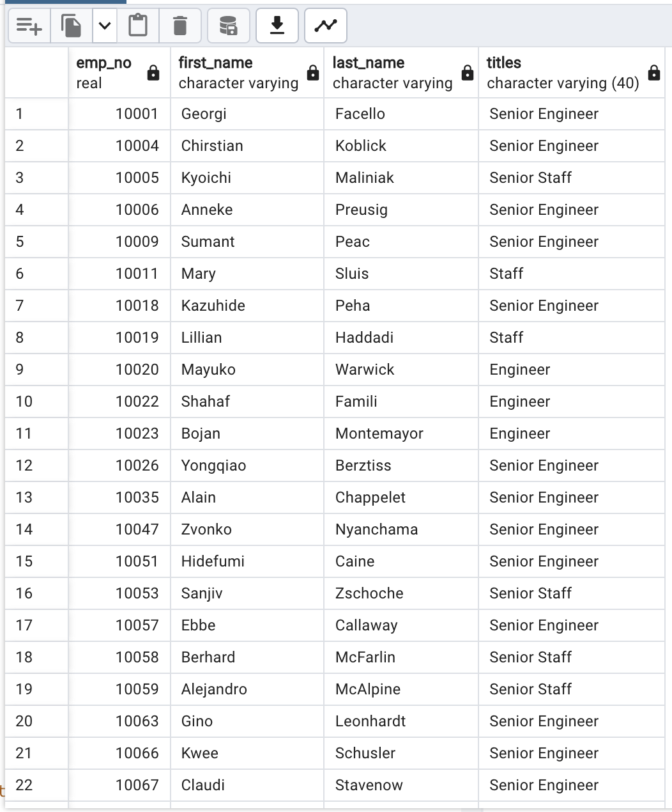

# Pewlett-Hackard-Analysis

### Project Overview

## Overview of the Analysis

Using all the knowledge from this module, we need to create a retirement table that were born between January 1, 1952 and December 31, 1955, and to maintain only the employees that retired. We also need to get a count of employees by title that retired. The criterion was based on the birth dates ranging from 1952 to 1955

## Results

### Deliverable 1

 - Created retirement titles table to capture all employees born between January 1, 1952 and December 31, 1955

   

 - Created Unique Titles table to capture first and last names, and the most recent title held by the employee

   

 - Created a retiring titles table with the employees that are retiring. With retiring table it is found that there are comparitively large no. of      employees holding senior titles and are about nearing retirement. 

### Deliverable 2

  - Created membership eligibility table for employees that are born in 1965. 

 

  - It is evident that 64% of employees are nearing retirement and only 1940 employees eligible for mentorship can be promoted to senior positions. There are not enough people at each level to mentor the upcoming new generation of Pelwett Hackard employees.
  - There are 133776 employees that will be retiring across 7 different roles in the organization. In order to minimize the "Silver Tsunami" impact, Engineer, Staff, Senior Engineer, Senior Staff roles need to be filled, based on the screenshot below

  - If we compare the ratios of people that will take up the senior positions and the actove employees, there is an average of 1 person for every 175 people in each role. This ratio is not healthy and there are not enough people at each level to mentor the upcoming new generation of Pelwett Hackard employees. 

## Summary

With this analysis it is evident that large no. of employees are about to retire or being directed to Mentorship. Hence, Pewlett Hackard will likely conduct an extensive hiring.

In this module we learnt basics of SQL, right from creating an Entity Relationship diagram (ERD), converting this to a logical schema before actually creating the tables in the database. 

Learnt about different types of datatypes, primary and foreign key constraints and how to retreive data from 2 tables using joins. We also learnt copying the summary data from a join query into a brand new table.
